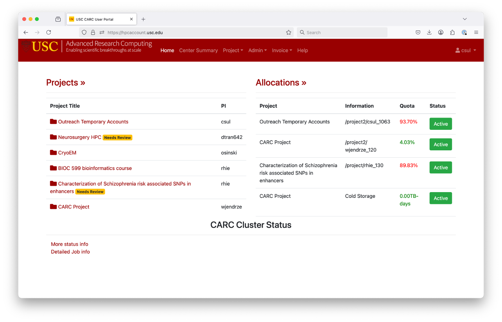
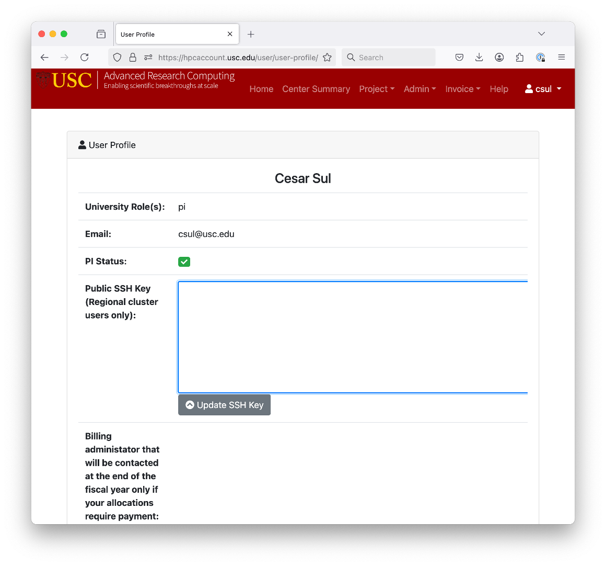

# How to Log in to Laguna

## Support and Resources
- **Support Email**: [LAGUNA-SUPPORT@USC.EDU](mailto:LAGUNA-SUPPORT@USC.EDU)
- **Website**: [Regional Computing Website](https://uschpc.github.io/regional-computing-website/)

## Login Methods
There are two primary ways to log in to Laguna:

### 1. Web Browser Method
- Navigate to: [https://laguna-ood.carc.usc.edu](https://laguna-ood.carc.usc.edu)
- Select **Clusters -> Regional Cluster Shell Access** to access the system.

### 2. Secure Shell (SSH) Method
To use SSH, you need an SSH key for authentication.

## Understanding SSH Keys
An **SSH key** is an alternative to password authentication that consists of:
- A **public key** stored on the server.
- A **private key** stored securely on your local system.

### How SSH Key Authentication Works
1. During login, the remote server checks if your public key is saved in `~/.ssh/authorized_keys`.
2. If a matching key is found, access is granted.

## Generating an SSH Key
To create an SSH key, use the following command:
```sh
ssh-keygen -t ecdsa
```
- `ecdsa` is a modern encryption algorithm.
- You may set a passphrase to enhance security.

### Example Output
```sh
Generating public/private ecdsa key pair.
Enter file in which to save the key (/Users/user/.ssh/id_ecdsa):
Enter passphrase (empty for no passphrase):
Enter same passphrase again:
Your identification has been saved in /Users/user/.ssh/id_ecdsa
Your public key has been saved in /Users/user/.ssh/id_ecdsa.pub
```

### Where to Find Your SSH Keys
Once generated, your keys are stored in `~/.ssh/`:
- `id_ecdsa` (Private Key - Keep Secure)
- `id_ecdsa.pub` (Public Key - Share with the Server)

## Copying Your SSH Key to Laguna
Unlike standard SSH key transfers, Laguna requires a specific process:
1. Visit [https://hpcaccount.usc.edu/](https://hpcaccount.usc.edu/)
2. Go to **User Profile**
3. Follow the steps to add your public key.
 
 

## Logging into Laguna via SSH
Once your SSH key is set up, log in using the following command:
```sh
ssh username@laguna1.carc.usc.edu
```
Replace `username` with your actual account name.

## Summary
- You can log in via **Web Browser** or **SSH**.
- SSH requires key-based authentication.
- Generate an SSH key with `ssh-keygen -t ecdsa`.
- Copy your public key to Laguna via [https://hpcaccount.usc.edu/](https://hpcaccount.usc.edu/).
- Use `ssh username@laguna1.carc.usc.edu` to connect via terminal.

For further assistance, contact **LAGUNA-SUPPORT@USC.EDU**.
****
